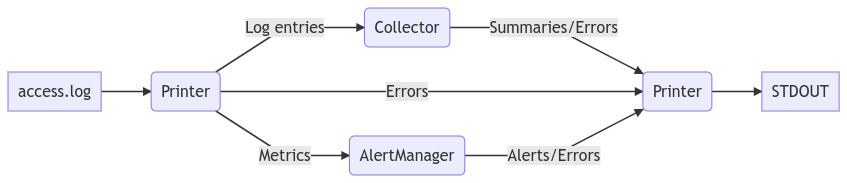

# HTTP Log Monitor
Tool to monitor w3c common log format's `access.log` file.
    
Example of output:
```
--------TOP SECTIONS---------
  Section      Number of hits
-----------    --------------
/there                     30
/                          26
/here                      25

-----------SUMMARY-----------
       Detail           Value
--------------------    -----
Total hits                 81
Traffic (per second)        8
Total success              26
Total redirects             0
Total errors               55
```

## High Level Design
**Legend**:
* Rounded rectangles are goroutines
* Normal rectangles are input/output
* Arrows are data flows (channels)


**Logic**:
* Reader reads in `tail -f` fashion from the log file
* Reader sends raw log entries to Collector
* Reader sends the metrics (counter of hits) to AlertManager
* Collector parses the log entries and updates the summary which is sent to Printer every N seconds
* AlertManager stores the metrics for past N seconds and sends alerts to Printer if the traffic is high
* All the errors are sent to Printer from all the other parties

## Build the binary
```
go build -o httplogmonitor cmd/main.go
```

## Run the monitor with all defaults
```
# file to read from: /tmp/access.log
# summary is displayed every 10 seconds
# monitoring window is 2 minutes
# high traffic threshold is 10 hits/s
./httplogmonitor
```

## Run the monitor with parameters
```
# -v stands for verbose, it shows the regular average traffic stats
./httplogmonitor -v -f <access_log_file> -i <summary_interval_in_sec> -w <monitor_window_in_sec> -t <threashold_in_hits_per_second>
```

## All flags
```
./httplogmonitor -h
Usage of ./httplogmonitor:
  -f string
    	Path to the log file. (default "/tmp/access.log")
  -i int
    	Interval between summary displays (seconds). (default 10)
  -n int
    	How many most hitted sections need to be displayed. (default 10)
  -p int
    	Polling interval (seconds). (default 1)
  -t int
    	Alerting threshold (hits per second). (default 10)
  -v	Be verbose (show regular average traffic stats).
  -w int
    	Monitoring window (seconds). (default 120)
```

## Test alerting
```
go test -v -run AlertManagerNominal ./...
```

## Run all the tests
```
go test ./...
```

## See the documentation
```
go doc -all reader
go doc -all collector
go doc -all alertmanager
go doc -all printer
go doc -all config
```

## Things to improve
* Different hit counting strategy for extremely fast growing log file (didn't try higher than `200h/s`). Maybe based on the timestamps from the logs or measuring the time between polls.
* Multiple alerting strategies. Like for instance: immediate alert (without waiting for the whole monitoring window).
* More fancy display: better tables, colors, better alert notification (the one which wouldn't be erased by summary output).
* More data in the summary: paths/sections with most errors, most updatable/redable paths/sections.
* Some sort of e2e test with a real web server writing its `access.log` file (I did some playground with `nginx` but not full fledged).
* Better unit test coverage
